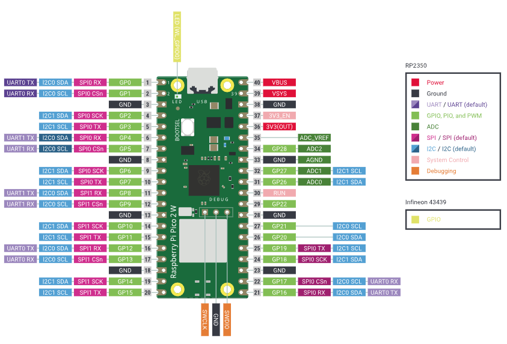
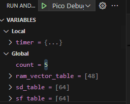

# Lab Week 4 - Monday Tuesday
## Raspberry Pi Pico Introduction
This lab we will start using the Raspberry Pi Pico. We will go over how to set it up and use it and then there will be a series of short excercises going over how to use specific functionality for the pico.

We know that during lecture, you have been(or will be) learning how to make ARM drivers for an ARM microcontroller from the ground up. Although that is good to know, we will just be using the pico sdk for the labs to save some time.

## Setup
Go through [setup.md](setup.md) in order to learn how to program the pico.

## Components Required
1. Raspberry Pi Pico
2. 4 LEDs (each with a 220 Ohm resistor)
3. 2 buttons (each with a 1k Ohm resistor)
4. 3 pin Potentiometer

## Pico Pinout
 

## Exercise 1: Pico IO
The first exercise will go over how to initialize pins and use them as inputs and outputs. You will make a simple counter that increments with one button and decrements with another. Each button press should only increment or decrement by 1. The counter will be displayed in binary on 4 LEDs. Since we will be using 4 LEDs, the possible values will be 0-15. You can decide what happens when incrementing at 15 or decrementing at 0.

### Wiring
Connect 4 LEDs to GPIO pins 2-5. Connect 2 buttons to GPIO pins 6 and 7.

### Project Creation
Press the "New C/C++ Project" in the Pico Project tab. In the newly opened "New Pico Project" tab, give your project a name and pick the correct board type. You do not need to add any features here. You can add them later. You can check one of the boxes for "Stdio support" if you plan on using `printf` and other stdio functions. Just make sure to run `stdio_init_all();` at the beginning of your main if you plan on doing so. Pick the default option for the debugger and then create your project. Once your project opens, add `#include "hardware/gpio.h"` at the top to allow gpio usage.

### Initialize Pins
First you need to tell the pico which gpio pins you will be using. There are 2 functions you can use for this.

1. `gpio_init(uint gpio);`
    - This function allows you to initialize a single gpio pin by passing it a specific gpio number. Using this function, you will need to call it once for every pin you want to initialize.
    - Ex: `gpio_init(4);` initializes gpio 4.
2. `gpio_init_mask(uint gpio_mask);`
    - This function allows you to initialize multiple pins at a time by using a mask. Every bit in the `gpio_mask` value corresponds to a gpio pin. A `1` in a gpio pin's corresponding bit initializes it.
    - Ex: `gpio_init_maks(0b1100);` initializes gpio pins 2 and 3 since their corresponding bits are `1`.

### Setting Direction of Initialized pins
After initializing pins, you still need to tell the pico if they are input or output. There are many functions and ways to do this but we will only go over 2 functions here that we think are probably the most convenient to use. If you are curious about the other ones, search "gpio_set_dir" int the include/hardware/gpio.h file of the raspberry pi pico sdk files.

1. `gpio_set_dir(uint gpio, bool out);`
    - This function sets a single gpio pin as input or output. It takes the gpio pin number that you are trying to set and a bool value(`true` for output, `false` for input).
    - Ex: `gpio_set_dir(3, true);` sets gpio 3 as output.
2. ` gpio_set_dir_all_bits(uint32_t values);`
    - This function can set multiple inputs and outputs at once. Every bit in the `values` value corresponds to a gpio pin. A `1` in a gpio pin's corresponding bit sets it to output while a `0` sets it to input.
    - Ex: ` gpio_set_dir_all_bits(0b1100);` sets gpio pins 0 and 1 to input and pins 2 and 3 to output.

### Controlling Output Pins
Again there aer multiple functions that can be used in order to control outputs. We will go over a couple of useful ones here.

1. `gpio_put(uint gpio, bool value);`
    - This function sets a single gpio pin to `1` or `0`. 
    - Ex: `gpio_put(3, 1);` turns gpio 3 to high
2. `gpio_put_masked(uint32_t mask, uint32_t value);`
    - This function can be used to controll multiple gpio pins at once. The `mask` value determines which bits you will be writing to. A `1` on a gpio pin's corresponding bit means that gpio pin will be written to. The corresponding bit on `value` is what is written to that bit.
    - Ex: `gpio_put_masked(0b111100, 0b110000);` turns gpio pins 4 and 5 on while pins 2 and 3 are turned off. Gpio pins 0 and 1 are unchanged since their value in the mask was `0`

#### Extra Info About Outputs
Thinking back to CS/EE120B, you might remember having to write the values to the PORTB/C/D registers in order to control the outputs. The raspberry pi pico does something simillar. There are 3 registers that the above functions use. They are the `gpio_set`, `gpio_clr` and `gpio_togl` registers. Setting a bit to `1` on the `gpio_set` register turns the corresponding gpio pin on. Setting a bit `1` on the `gpio_clr` turns the corresponding pin off. A `1` on `gpio_togl` toggles that corresponding pin. You can actually access them yourself by doing `sio_hw->gpio_set/clr/togl`. For example you can turn gpio pins 2 and 3 on by doing `sio_hw->gpio_set = 0b1100;`.

### Reading Input Pins
There is really only one useful function that you need to read an input.
1. `gpio_get(uint gpio);`
    - This just returns the input value of gpio pin number passed to it.
    - Ex: `gpio_get(8);` reads gpio pin 8.

While there is a `gpio_get_all();` function that returns the value for all gpio pins, It really isn't that useful so you usually don't need to read multiple pins together at the same time.

#### Extra Info About Inputs
Like the output registers, there is a register that the `gpio_get(uint gpio)` function uses to check inputs. It is the `gpio_in` register. You can use it your self by doing `sio_hw->gpio_in & 1<<gpioNum`. For example `sio_hw->gpio_in & 1<<8` checks gpio pin 8.

>Since we are using C/C++ the state machine template used for CS/EE120B works with the pico so think about using an SM for this exercise. Just make sure to use the pico functions for initializtions, inputs and outputs.

## Exercise 2: Timer Interupt
There is a lot of different functionality with timers. For this exercise, we will go over a quick way to make a timer interupt so that you can make synch SMs like CS/EE120B. 

For this exercise, you will make a counter just like exercise 1, but now, if you hold a button, it will continue to increment or decrement every 500ms.

### Wiring
This exercise will use the same wiring as exercise 1.

### Set up a Timer Interupt
In CS/EE120B, a header file named `timerISR.h` was given to you that handles all the setup for a timer interupt. Lucky for us, the pico sdk already has functionality for this set up. To initialize a timer interupt, you first need to create a timer variable. you can do this by doing `struct repeating_timer timer;`. After, you need to specify the period at which the timer interupt will go off and what function runs when it does so. This is done by doing the following: `add_repeating_timer_ms(1000, timer_callback, NULL, &timer);`. 
1. The first parameter is the period. When the period passed into this function is positive, the timer starts again AFTER the callback function is done executing. In order to get it to start right away, no matter what, you should make this negative.
2. The second is the function that is called when the interupt goes off(This would be the `TimerISR()` function from CS/EE120B). This function must be of type `bool` and must return `true` if you want the timer to continue. 
3. The 3rd parameter is the data to be passed to the callback function. This will be `NULL` a lot of the times since most of the variables we use in the timer callbacks will be globals.
4. The last parameter is the timer variable created earlier. 

Here is an example of you would do to initialize a timer interupt that calls a synch SM called `Tick` every 500ms:
```C
struct repeating_timer timer;
add_repeating_timer_ms(-500, Tick, NULL, &timer);
```
>In order to do Concurrent SynchSMs, you would replace the `timer_callback` function with the scheduler function used in CS/EE120B. You just need to change it from a `void` function into a `bool` and make it return `true` at the end.

## Exercise 3: ADC
For this exercise you will be using a potentiometer to set the 4 LEDs instead of the buttons. The value of the potentiometer will be mapped to a range of 0-15 and displayed on the LEDs. 

### Wiring
Looking at the pinout above, you will see that the pico only has 3 ADC pins. The 3 ADC channels are connect to GPIO pins 26-28. For this exercise, the 4 LEDs can remain on GPIO pins 2-5. The potentiometer should be connected to ADC0(GPIO 26).

### Using ADC
In order to use the ADC on the pico, you must add `#include "hardware/adc.h"` to the top of your code. Then go to your `CMakeLists.txt` file and add `hardware_adc` to the `target_link_libraries` section. This is what you will need to do to use some libraries from the pico sdk. Your `target_link_libraries` section should then look something like this:
```
# Add any user requested libraries
target_link_libraries(PicoLab 
        hardware_adc
        )
``` 

Once that is done, you can then initialize ADC functionality by running `adc_init();`. You will then need to initialize the adc pin you will use by running `adc_gpio_init(26);`.

To read an analog input, you need to use 2 functions. The first is `adc_select_input(uint input);`. This function determines which ADC channel to use for ADC(gpio pin 26 is ADC0 so you will need to so `adc_select_input(0)`). After that, you can just use `adc_read()` to read it. The range of values that the ADC returns is [0,4095]. 

### Map function from CS/EE120B
```C
long map(long x, long in_min, long in_max, long out_min, long out_max) {
    return (x - in_min) * (out_max - out_min) / (in_max - in_min) + out_min;
}
```

## Raspberry Pi Pico Debug Probe
If you have the Raspberry Pi Debug Probe, you can use it to debug your code using GDB. In CS/EE120B, you had to use print statements to debug your code which could get tedious and annoying. While you can still do that with the pico, the debug probe alliws you to debug easier. 

To start debugging with the probe, press the "Debug Project" option in the Pico Project tab. This will allow you to debug directly in VScode. After the debug session starts, you will see a small task bar somewhere on your screeen(usually at the top of your VScode) with the debug functions.


From this task bar, you can run your code, pause it, step over a function, step into a function, step out of a function and stop the debug section. In the tab with your actual code, you will see a line that is highlighted. This is the line you are currently at. You will only see this highlighted line when your code is paused. You can then use the debug bar to follow the execution of your code and see what is being executed. The "Step Over" button just executes the line you are at. If you are at a function, you can use the "Step Into" button to actually go into that function and see what is being executed. You can then use the "Step Out" button to go back if you don't want to follow the execution of the entire funciton. While doing this, you can actually see the value of different variables in a tab at the top left of your VScode window.



### Breakpoints
Sometimes, the part of your code you want to debug is difficult to get to one line at a time or difficult to stop at. In order to debug more acurately, you can use breakpoints. You can pick lines in your code to automaticaly stop at when debugging, that you can then analyze more in depth using what was mentioned above. To set a break point, just click to the left of the line you want to break at. A red dot will then appear next to the line number showing that a breakpoint has been set there. Sometimes a line cannot have a breakpoint so when clicking to add the red dot, it will instead place a breakpoint at the next possible line. After setting a breakpoint, you can press the "Continue" button and your program will automatically stop when it reaches the line you placed the breakpoint at.

## Submission
This will be a single session lab so it will be due Monday week 5(4/27). You can just submit your code for the 3 exercises on gradescope along with your final CMakeLists.txt file.