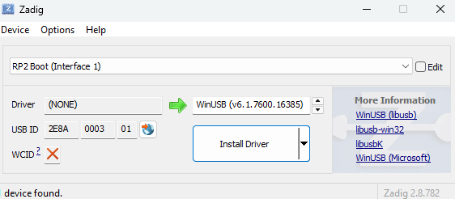
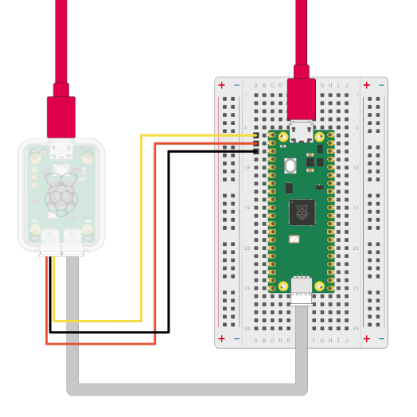

# Setup the Pico
In order to program the pico, we will be using the "Raspberry Pi Pico" extension for VScode. In the extensions tab of VScode, search for the "Raspberry Pi Pico" Extension and install it. It should be the one published and verified by Raspberry Pi. Once you install the extension, you should see the "Raspberry Pi Pico Project" tab on the left side of VScode. 

## Blink Example
To make sure that evrything works and you know how to program the Pico, we will go over how to program an example program that toggles the on board LED every 250ms. 

First open the Raspberry Pi Pico Project tab. We will be using C/C++ for the pico in this class so press the "New C/C++ Project" at the top of the tab. This will open the "New Pico Project" tab. Next to the "Name" text box, there will be a button that says "Example". Press this and then select the "blink" example for the Name of the project. Then make sure you pick the correct board type. It should be either the Pico W or the Pico 2 W. Then pick the location you want the example project to be made. You should be able to use the default debugger settings with the Raspberry Pi debugger. You can then press "Create". If this is your first ever project using this extension, it will now start dowloading all the pico libraries. This may take some time.

Once everything has been downloaded, a new VScode window will open with the new sample project open. Now if you open the Raspberry Pico extension tab, you will see all the "Project" options are no longer greyed out. You can now compile the sample project by pressing the "Compile Project" option in this tab. Once the project is compiled you should be able to see a bunch of build files in the build directory. The important one id the one that has the `.uf2` file ending. If this fil exists, you can go on to program the pico.

## Ways to Program Pico:
There are 3 ways to program the pico.
### Option 1: Drag and drop.
This is the most basic but probably the most tedious to do everytime you want to uplaod your code to the pico. You first need to connect the pico while in BOOTSEL mode. To do this, plug in your pico to your machine while holding the button on the pico that is labeled "BOOTSEL". You must hold this button while connecting the pico. Pressing the button after connecting while not work. You will know that you connected in BOOTSEL mode correctly if you see a new drive connect to your machine. You can then program the pico by dragging the `.uf2` file from your build directory into the new drive. If this is successful, the new drive will disconnect and the on board LED of your Pico will start blinking. Everytime you want to reflash your pico, you will have to disconnect it and reconnect it in BOOTSEL mode.

### Option 2: Pico Project "Run" Button
This option is very similar to the first option. It is essentially the same thing except you do not need to drag and drop the `.uf2` file. The pico extension will handle this part for you by just pressing the "Run Project (USB)" option from the pico project tab. Everything mentioned about BOOTSEL in option 1 applies to this option as well. 

#### Windows Drivers Issue
If you are on Windows, the first time you do this option, you might get an error that says something like `RP2040 device at bus 4, address 8 appears to be in BOOTSEL mode, but picotool was unable to connect. You may need to install a driver via Zadig`. If this is the case you can go to the Zadig website and [download](https://zadig.akeo.ie/downloads/) zadig-2.8(2.9 is the newest but did not work for us). Once it is downloaded, run it while the pico is connected in BOOTSEL mode. You should have a window that looks like the following open:

Press the "Install Driver" button to install the driver. Once this is done, you should be able to flash the pico using the "Run Project (USB)" option.

### Option 3: SWD over Debugger
The last option is probably the easiest since you do not need to connect the pico in BOOTSEL mode, however it does require you to have the Raspberry Pi Debug probe. 

### How to connect the probe
The debug probe has 3 connections that you need to handle. The first is the micro usb to usb. This should connect from the debug probe to your machine. The next is the JST-SH to JST-SH connector. This is the connection that has 2 grey wires and a red wire. One side should connect to port labeled "D" on the actual probe. The other side should connect to the pico's debug port. The last connection is a JST-SH to 3 male pins. The JST-SH side should be connected to the probes "U" port. The other side will connect to the pico's UART pins and ground. The yellow wire should go to the pico's UART0 TX. The orange goes to the UART0 RX pin. The balck wire goes to ground.

### Programing using the debugger
Once everything is connect on the debug probe and both the probe and pico are connect to your machine, you should be able to program your pico whenever you want by using the "Flash Project(SWD)" option in the Pico Project tab.
>Note: If you are on Windows and you did not install the drivers from option 2, you might need to install them for this option.

## Setup Conclusion
If you were able to follow the instructions above and got the blink sample program working, you should be able to start working on the actual exercises.
